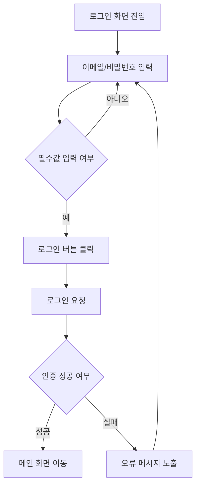

# [SC001] 로그인 화면

## 화면 메타정보

| 항목 | 내용 |
|------|------|
| 화면 ID | `SC001` |
| 화면명 | 로그인 |
| 작성자 | `example` |
| 최종 수정일 | `YYYY-MM-DD` |
| 상태 | `draft` |
| 관련 프로세스 | 사용자 인증 |
| 피그마 링크 | [Figma]() |

<!-- 상태 설명:
  - draft: 초안 작성 중. 개발 착수 불가
  - review: 기획/디자인 리뷰 중. 피드백 반영 대기
  - confirmed: 확정. 개발 착수 가능
-->

---

## 화면 개요

### 목적

사용자가 등록된 계정 정보로 서비스에 로그인하는 화면

### 진입 경로

- 앱 최초 진입 시
- 로그아웃 후 재진입 시
- 인증 만료 후 로그인 필요 시

---

## 화면 전환 데이터

### 이전 화면에서 가져오는 데이터

(없음)

### 다음 화면으로 넘기는 데이터

| 항목 | 대상 화면 | 설명 |
|------|-----------|------|
| 사용자 ID | `SC010` | 로그인된 사용자를 식별하기 위한 값 |
| 인증 토큰 | `SC010` | 로그인 상태 유지를 위한 인증 값 |

---

## 화면에서 다루는 데이터

| 항목 | 종류 | 필수 여부 | 출처 | 설명 | 예시 |
|------|------|-----------|------|------|------|
| 이메일 | 텍스트 | O | - | 로그인에 사용하는 이메일 주소 | example@email.com |
| 비밀번호 | 텍스트 | O | - | 로그인에 사용하는 비밀번호 | example1234 |
| 자동 로그인 여부 | 참/거짓 | X | - | 자동 로그인 사용 여부 | true |
| 사용자 ID | 고유ID | O | - | 로그인 성공 시 사용자 식별 값 | USER_001 |
| 인증 토큰 | 텍스트 | O | - | 로그인 성공 시 발급되는 인증 값 | token_sample |
| 오류 메시지 | 텍스트 | X | - | 로그인 실패 사유 안내 문구 | 이메일 또는 비밀번호를 확인해주세요 |

---

## 데이터 요청

### 1. 로그인 요청

| 항목 | 내용 |
|------|------|
| 요청 목적 | 사용자의 로그인 정보를 검증하고 로그인 상태를 생성한다 |
| 동작 | 저장 |
| 로그인 | 불필요 |
| 트리거 | 로그인 버튼 클릭 시 |

**서버에 전달하는 데이터**

| 조건 항목 | 종류 | 필수 여부 | 설명 |
|------|------|-----------|------|
| 이메일 | 텍스트 | O | 로그인에 사용하는 이메일 주소 |
| 비밀번호 | 텍스트 | O | 로그인에 사용하는 비밀번호 |
| 자동 로그인 여부 | 참/거짓 | X | 자동 로그인 사용 여부 |

---

## 사용자 인터랙션

- [ ] 화면 진입 → 이메일 입력창, 비밀번호 입력창, 로그인 버튼 노출
- [ ] 이메일 입력 → 입력값 반영
- [ ] 비밀번호 입력 → 입력값 반영
- [ ] 자동 로그인 체크박스 클릭 → 선택 상태 변경
- [ ] 로그인 버튼 클릭 → (로그인 요청) 진행
- [ ] 로그인 성공 → `SC010` 화면으로 이동
- [ ] 로그인 실패 → 오류 메시지 노출
- [ ] 회원가입 버튼 클릭 → 회원가입 화면으로 이동
- [ ] 비밀번호 찾기 버튼 클릭 → 비밀번호 찾기 화면으로 이동

---

## 화면 상태

| 상태 | 조건 | 표시 내용 |
|------|------|-----------|
| 초기 | 화면 최초 진입 | 이메일, 비밀번호 입력 영역 및 로그인 버튼 노출 |
| 입력 가능 | 이메일, 비밀번호 입력 전/중 | 사용자가 값을 입력할 수 있는 상태 |
| 로그인 가능 | 필수값 입력 완료 | 로그인 버튼 활성화 |
| 로그인 진행 중 | 로그인 요청 처리 중 | 버튼 비활성화 및 진행 상태 표시 |
| 로그인 실패 | 로그인 요청 실패 | 오류 메시지 노출 |
| 로그인 성공 | 로그인 요청 성공 | 다음 화면으로 이동 |

---

## 비즈니스 규칙

1. 이메일과 비밀번호가 모두 입력된 경우에만 로그인 버튼을 활성화한다.
2. 비밀번호 입력값은 마스킹하여 노출한다.
3. 로그인 실패 시 오류 사유는 일반화된 문구로 안내한다.
4. 자동 로그인 선택 시 다음 앱 실행 시 로그인 상태를 유지할 수 있다.
5. 이미 로그인된 상태에서 진입한 경우 로그인 화면을 거치지 않고 다음 화면으로 이동할 수 있다.

---

## 프로세스

## 예외/엣지 케이스

1. 이메일 또는 비밀번호를 입력하지 않은 경우 → 로그인 요청을 보내지 않는다.
2. 입력 형식이 올바르지 않은 이메일인 경우 → 형식 오류 메시지를 노출한다.
3. 로그인 요청 중 네트워크 오류가 발생한 경우 → 로그인 실패 메시지를 노출하고 현재 화면을 유지한다.
4. 인증 정보가 유효하지 않은 경우 → 로그인 실패 처리 후 재입력을 유도한다.
5. 로그인 요청 중 중복 클릭한 경우 → 중복 요청이 발생하지 않도록 버튼을 비활성화한다.

---

## 연관 화면 (선택)

| 화면 ID | 화면명 | 이동 조건 |
|---------|--------|-----------|
| `SC002` | 회원가입 | 회원가입 버튼 클릭 시 이동 |
| `SC003` | 비밀번호 찾기 | 비밀번호 찾기 버튼 클릭 시 이동 |
| `SC010` | 메인 | 로그인 성공 시 이동 |
